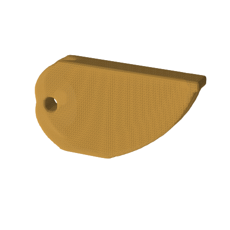
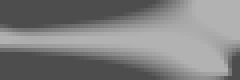
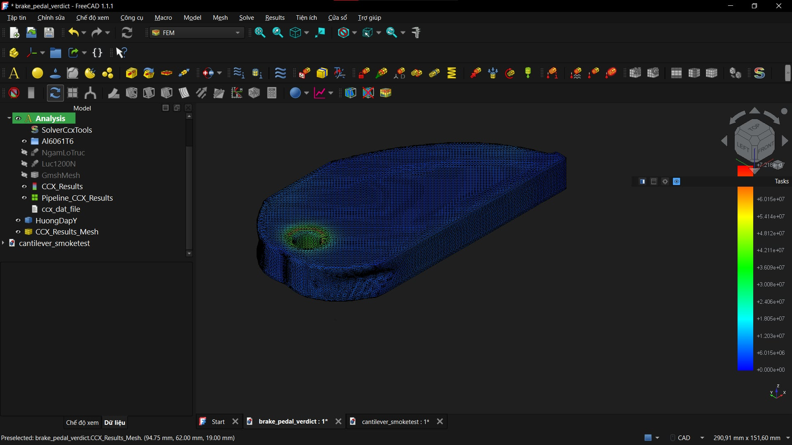

<p align="center"></p>

<h1 align="center">GEOMETRIC PHYSICS (GP)</h1>

<p align="center"><b>Không ai vẽ hình trên. Vật lý vẽ.</b><br>Con người chỉ khai: <i>1200N · nhôm 6061 · lỗ trục · giảm 55% vật liệu.</i></p>

---

## GP là gì?

GP là một engine tối ưu hóa cấu trúc (topology optimization: FEA + SIMP + OC) viết bằng Python, chạy không cần giao diện.

Bạn đưa vào một file `spec.json` mô tả bài toán cơ học: không gian thiết kế, vị trí ngàm, lực tác dụng, vật liệu và tỷ lệ vật liệu được dùng. GP trả về hình dạng tối ưu dưới dạng file STL in 3D được, kèm báo cáo mà cả người lẫn máy đều đọc được.

Tên gọi trong xưởng: **Thợ Rèn Trọng Lực** — không sáng tạo, không chiều mắt ai, nhưng mỗi đường nét đều có định luật vật lý đứng sau, và sản phẩm nào cũng kèm bằng chứng chịu lực.

<p align="center"><br><i>94 vòng lặp: từ khối đặc, vật liệu tự rút khỏi nơi vô dụng và đọng lại thành dàn chịu lực.</i></p>

## Bằng chứng trước, lời nói sau

GP không yêu cầu bạn tin. Nó đã đi qua ba vòng kiểm chứng độc lập, toàn bộ số liệu nằm trong repo này:

| Vòng kiểm chứng | Kết quả đo được | Bằng chứng |
|---|---|---|
| **Chuẩn học thuật quốc tế** | Khớp top88 (bài MBB kinh điển) với sai lệch **0.006%** · khớp bản đối chứng 3D độc lập với sai lệch **0.028%** · đạo hàm kiểm bằng finite-difference tới 1.8e-07 · hai lần chạy cho kết quả trùng nhau **từng bit** | thư mục `tests/` (hơn 220 test, có golden hash canh giữ) |
| **Trọng tài công nghiệp độc lập** | Bàn đạp phanh do GP thiết kế được nạp vào FreeCAD/CalculiX với lưới mịn gấp 13 lần: ứng suất Von Mises lớn nhất **72.18 MPa**, thấp hơn nhiều giới hạn chảy 276 MPa · hệ số an toàn **3.82** · 0 trên 93.763 điểm đo vượt ngưỡng | `bench/freecad_brake_verdict.json` và ảnh bên dưới |
| **Sát hạch hộp đen 10 bài** | **10/10 ĐẠT** — kỳ vọng vật lý của từng bài được ghi và commit vào git **trước khi chạy**, nên không thể sửa điểm sau khi biết kết quả · tái xác nhận trên máy thật | `bench/gauntlet/TONG_KET.md` |

<p align="center"><br><i>Phán quyết của trọng tài: vùng ứng suất cao (màu nóng) tập trung đúng vành lỗ trục — nơi cơ học dự đoán — và dừng ở 72 MPa.</i></p>

Một chuyện ít repo nào kể: vòng sát hạch đầu tiên chỉ đạt 9/10, và còn bắt được một bug thật. Cả bài trượt lẫn con bug đều nằm nguyên trong lịch sử git, được sửa đúng quy trình rồi mới có 10/10. Tôi giữ lại vết sẹo, vì đó là cách duy nhất để con số 10/10 có ý nghĩa.

## Dùng thử trong 5 phút

Cài thư viện:

```
pip install -r requirements.txt
```

GP có đúng ba lệnh. Exit code là cam kết: `0` thành công, `1` chạy xong nhưng không đạt, `2` spec không hợp lệ.

```
python -m geophys validate examples/spec_brake_smoke.json
python -m geophys run examples/spec_brake_smoke.json --outdir runs/thu
python -m geophys report runs/thu
```

Một spec tối giản — thanh công-xôn nhôm chịu 500N, giảm 60% khối lượng:

```json
{
 "nelx": 24, "nely": 12, "nelz": 6, "volfrac": 0.4,
 "element_size_mm": 4.0, "material_name": "nhom_6061_t6",
 "loads":    [{"x": 24, "y": 0, "z": 3, "fy": 500.0}],
 "supports": [{"face": "x0", "dof": "all"}],
 "simp": {"p": 3.0, "rmin": 1.5}, "preserve": [], "void": []
}
```

Kết quả nhận về: file `.stl` in 3D được, ảnh render `.png`, trình xem 3D chạy offline dạng HTML, và `report.json`.

Nếu spec sai, lệnh `validate` trả về JSON mô tả lỗi gồm mã lỗi, vị trí sai và gợi ý sửa — không ném traceback vào người dùng.

## Nếu bạn là một AI agent

Toàn bộ hợp đồng giao tiếp nằm trong **[AGENT.md](AGENT.md)**. Chỉ cần đọc file đó, một agent có thể tự vận hành trọn vòng: nhận đề bài bằng tiếng Việt, viết spec, kiểm tra, chạy và tự chấm kết quả.

Điều này đã được kiểm chứng: 3/3 bài thử agent tự làm không cần người can thiệp, và trong 10 bài sát hạch có một bài agent tự sửa spec hỏng chỉ bằng thông tin từ JSON lỗi — đúng 3 vòng là xong.

## Giới hạn hiện tại — nói thẳng

- GP làm việc trên lưới voxel: kết quả là bộ khung chịu lực tối ưu, không phải bản vẽ CAD với bề mặt cong tinh xảo. Chi tiết nhỏ hơn kích thước voxel sẽ không hiện ra.
- GP mới xử lý tải tĩnh. Chưa tính mỏi, chưa tính va đập.
- Trần thực tế trên laptop phổ thông: lưới khoảng 64³, mất chừng 25 phút và 700MB RAM. Đây là số đo thật, không phải ước lượng.
- Vùng bảo tồn chiếm quá 70% ngân sách vật liệu sẽ bị cảnh báo — thuật toán cần không gian trống để làm việc.
- Kết quả tối ưu là độ cứng tương đối. Muốn kết luận độ bền tuyệt đối, hãy đưa qua một phần mềm FEM độc lập — như chính tôi đã làm với CalculiX ở trên.

## Cách dự án này được xây

GP do một AI agent viết toàn bộ, dưới **Quy chuẩn Sammis Agent Code**. Trong quy chuẩn đó, con người giữ ba quyền không bao giờ giao cho máy: quyết định triển khai, kiểm chứng với thực tế, và định nghĩa thế nào là đúng.

Vài luật đáng chú ý: mọi module hoàn thiện đều bị khóa kèm snapshot chống sửa lén; hai bài golden phải cho kết quả trùng từng bit sau mọi thay đổi; kỳ vọng của thí nghiệm phải được commit vào git trước khi chạy. Mỗi sự cố gặp phải — benchmark trượt lần đầu, lỗi encoding tiếng Việt trong FreeCAD, bug resume — đều trở thành một luật mới trong sổ tay, không trở thành bí mật.

Hồ sơ đầy đủ: `GEOMETRIC_PHYSICS_PLAN.txt` (hợp đồng gốc) · `MANIFEST.md` (trạng thái hiện tại) · `bench/` (toàn bộ bằng chứng).

## Bạn có bài toán thật?

Một cái giá đỡ hay gãy. Một chi tiết máy muốn nhẹ hơn. Một món đồ in 3D đang tốn nhựa vô ích.

Nếu nó ngàm được, đặt lực được, và đáng để nhẹ đi — thợ rèn muốn nghe về nó.

— **Sammis**
